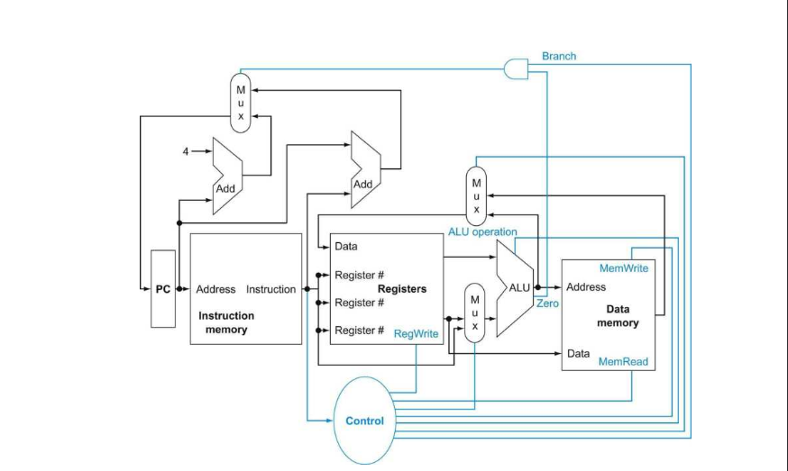

<h1 align="center">32-bit Single-Cycle RISC-V Processor</h1>

  
  
  
  

  A modular, single-cycle implementation of a RISC-V RV32I processor written in Verilog HDL. 
Designed for learning computer architecture, digital design, and VLSI fundamentals.

<h2>📁 Module Breakdown & Functionality</h2>

<table>
  <tr>
    <th>Module</th>
    <th>Functional Description</th>
  </tr>
  <tr>
    <td><b>Program Counter (PC)</b></td>
    <td>Synchronous logic that tracks the execution flow. Supports <b>asynchronous reset</b> to 0x00000000.</td>
  </tr>
  <tr>
    <td><b>Instruction Memory</b></td>
    <td>Acts as the ROM for the CPU. Loads compiled <code>.hex</code> files using <code>$readmemh</code>. 1KB depth (1024 words).</td>
  </tr>
  <tr>
    <td><b>Control Unit</b></td>
    <td>The central decoder. It interprets opcodes and generates signals like <code>RegWrite</code>, <code>MemToReg</code>, and <code>ALUSrc</code>.</td>
  </tr>
  <tr>
    <td><b>Immediate Generator</b></td>
    <td>Extracts and sign-extends immediate values for <b>I, S, B, U, and J</b> formats, handling complex bit-shuffling for branches.</td>
  </tr>
  <tr>
    <td><b>Register File</b></td>
    <td>32-word (32-bit) fast access storage. <b>x0</b> is hardwired to zero. Supports dual-read and single-write in one cycle.</td>
  </tr>
  <tr>
    <td><b>ALU (Arithmetic Logic Unit)</b></td>
    <td>Performs arithmetic (ADD/SUB), logical (AND/OR/XOR/SLT), and comparison operations. Includes a Zero Flag for branching.</td>
  </tr>
  <tr>
    <td><b>Data Memory</b></td>
    <td>Random Access Memory for <code>LW</code> and <code>SW</code>. Synchronous write/Asynchronous read for maximum timing stability.</td>
  </tr>
  <tr>
    <td><b>PC Logic</b></td>
    <td>Calculates the next PC address based on jumps, branches, or standard increments (PC+4).</td>
  </tr>
</table>

<h2>🪧Single-Cycle RISC-V (RV32I) Datapath</h2>

<h2>📜 Supported Instruction Set (ISA)</h2>

<table width="100%">
  <thead>
    <tr>
      <th>Type</th>
      <th>Mnemonic</th>
      <th>Opcode (Hex/Bin)</th>
      <th>func3</th>
      <th>func7</th>
    </tr>
  </thead>
  <tbody>
    <tr>
      <td><b>R-Type</b></td>
      <td>ADD, SUB, AND, OR, XOR, SLT</td>
      <td><code>0110011</code></td>
      <td>Various</td>
      <td>0000000 / 0100000</td>
    </tr>
    <tr>
      <td><b>I-Type (ALU)</b></td>
      <td>ADDI, ANDI, ORI, XORI, SLTI</td>
      <td><code>0010011</code></td>
      <td>Various</td>
      <td>N/A</td>
    </tr>
    <tr>
      <td><b>I-Type (Load)</b></td>
      <td>LW</td>
      <td><code>0000011</code></td>
      <td>010</td>
      <td>N/A</td>
    </tr>
    <tr>
      <td><b>I-Type (Jump)</b></td>
      <td>JALR</td>
      <td><code>1100111</code></td>
      <td>000</td>
      <td>N/A</td>
    </tr>
    <tr>
      <td><b>S-Type</b></td>
      <td>SW</td>
      <td><code>0100011</code></td>
      <td>010</td>
      <td>N/A</td>
    </tr>
    <tr>
      <td><b>B-Type</b></td>
      <td>BEQ, BNE, BLT, BGE</td>
      <td><code>1100011</code></td>
      <td>Various</td>
      <td>N/A</td>
    </tr>
    <tr>
      <td><b>U-Type</b></td>
      <td>LUI</td>
      <td><code>0110111</code></td>
      <td>N/A</td>
      <td>N/A</td>
    </tr>
    <tr>
      <td><b>J-Type</b></td>
      <td>JAL</td>
      <td><code>1101111</code></td>
      <td>N/A</td>
      <td>N/A</td>
    </tr>
  </tbody>
</table>

<h2>🧩 Tools used </h2> </h2>

  The processor's instructions is written in assembly (<code>.s</code> file) and compiled using <b>RARS (RISC-V Assembler and Runtime Simulator)</b>. 
  The machine code is then exported as a <code>hex</code> file for the hardware to read.
  <h4>

 1. Text editor / IDE
<ul>
    <li> VS Code </li> 
</ul>
 2. RARS
<ul>
 <li> For RISC-V assembly → HEX</li>
</ul>

 3. Verilog simulator
<ul>
  <li>iverilog + vvp</li>
</ul>
<pre>
<code>iverilog -o processor_sim RTL/*.v</code>
<code>vvp processor_sim</code>
</pre>

<h3>Synthesizable Instruction Memory (20-Instructions)</h3>

the <code>instruction_memory.v</code> is pre-loaded with a test suite of 20 instructions covering all types:

<pre><code>
// Add this to your Instruction_memory.v for a 20-instruction test suite
initial begin
    $readmemh("instruction.hex", memory);
    /* The instruction.hex should contain 20 instructions such as:
    00500113 // addi x2, x0, 5
    00a00193 // addi x3, x0, 10
    00310233 // add  x4, x2, x3
    ... (Up to 20 instructions)
    */
end
</code></pre>

<h2>🚀 Advantages & Future Scope</h2>
<ul>
  <li><b>Single-Cycle Efficiency:</b> Executing one instruction per clock pulse ensures deterministic timing.</li>
  <li><b>Modular Design:</b> Easy to swap out the ALU or Control Unit for higher-performance versions.</li>
  <li><b>FPGA Ready:</b> Fully compatible with Xilinx Vivado for deployment on boards like Basys3 or Nexys A7.</li>
</ul>

<h4>🔜 Coming Soon:</h4>
<ul>
  <li><b>M-Extension:</b> Hardware support for Multiplication and Division.</li>
  <li><b>Pipelining:</b> Transition to a 5-stage pipeline with hazard detection.</li>
  <li><b>CSRs:</b> Control and Status Registers for exception handling.</li>
   <li><b> Test bench in SystemVerilog </b></li>
</ul>

<h2>🙏 Acknowledgement</h2>

This project is made possible thanks to the
<b>RISC-V open-source Instruction Set Architecture (ISA)</b>.

RISC-V’s open and royalty-free specification enables transparent learning,
research, and innovation in computer architecture. The ability to study,
implement, and extend a real-world ISA without licensing restrictions is
fundamental to this work.

This processor design is inspired by the official RISC-V specifications
and the global open-source community that supports and advances the RISC-V ecosystem.

<h2 align="center">📩 Connect with Me</h2>

  

  I'm always open to discussing <b>RISC-V architecture</b>, documentation, or potential collaborations!

<b>Thanks to RISC-V — open hardware, open knowledge, open future.</b>

